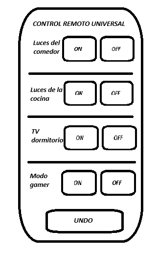
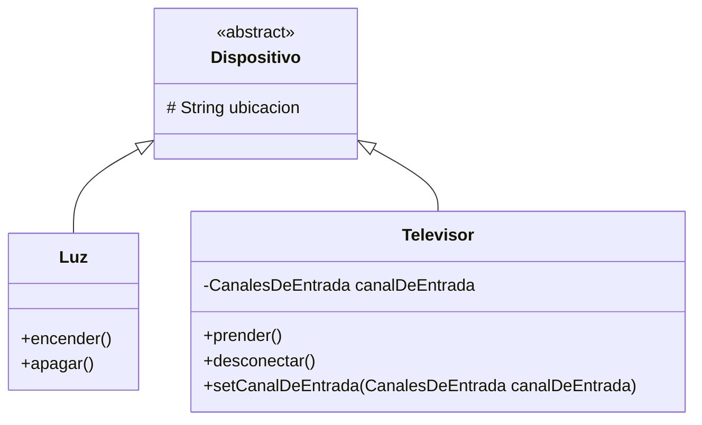
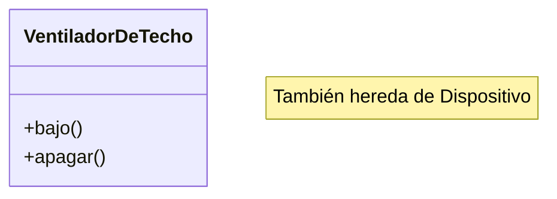
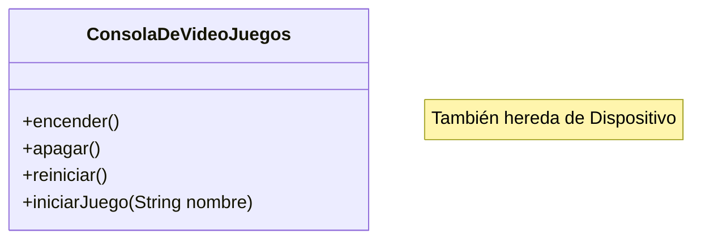

# Encuentro para la comunidad de prácticas de desarrollo

## Contexto

Nos piden desarrollar una api para un control remoto universal. Este control remoto puede controlar diferentes dispositivos: luces, televisores, equipos de música, consolas de videojuegos, etc, los cuales tienen su propia forma de encenderse y apagarse.

El control remoto tendrá siete ranuras programables a las que se le debe poder asignar distintos dispositivos, y por cada ranura estarán los correspondientes botones de encendido y apagado. El control también tendrá un botón global de deshacer.

En el paquete 'proveedores' encontrarán clases que representan diferentes dispositivos, cada una con sus propios métodos para encender y apagar.

Se busca diseñar una solución que permita integrar de manera flexible nuevos dispositivos domóticos de diferentes proveedores, sin necesidad de modificar el código del control remoto.



## Clases de los proveedores



## Control Remoto

La implementación inicial del control remoto es la siguiente:

```java

    public void encender(int ranura) {
        Dispositivo dispositivo = this.dispositivos[ranura];
        if (dispositivo != null) {
            if (dispositivo instanceof Luz) {
                ((Luz)dispositivo).encender();
            } else if (dispositivo instanceof Televisor) {
                ((Televisor)dispositivo).prender();
            }
        }
    }

    public void apagar(int ranura) {
        Dispositivo dispositivo = this.dispositivos[ranura];
        if (dispositivo != null) {
            if (dispositivo instanceof Luz) {
                ((Luz)dispositivo).apagar();
            } else if (dispositivo instanceof Televisor) {
                ((Televisor)dispositivo).desconectar();
            }
        }
    }

```

## Actividad 1 - Ventilador de techo

A las clases existentes del proveedor se agrega un nuevo dispositivo: VentiladorDeTecho



El objetivo es utilizar otra ranura del Control Remoto para poder manejar este dispositivo nuevo. ¿Como podemos evitar agregar otro if else en los métodos de encender y apagar?

## Actividad 2 - Null check

Las ranuras pueden tener o no un dispositivo asignado. ¿Como podemos evitar chequear si la ranura está vacía antes de interactuar con el dispositivo?

## Actividad 3 - Undo

Implementar la funcionalidad de **"Deshacer"**. El botón de deshacer debe revetir la última acción realizada.
Si la última acción fue: "Encender luces del comedor" al presionar deshacer las luces del comedor deben apagarse.

## Actividad 4 - Modo Gamer

El proveedor nos comparte una nueva clase para manejar consolas de videojuegos:



Implementar en una ranura del Control Remoto el Modo Gamer que para el botón encender debe:

- Apagar la luz del comedor
- Encender la TV con canal de entrada en HDMI1
- Encender la consola

## Como ejecutar por fuera del IDE

``` sh run.sh ```